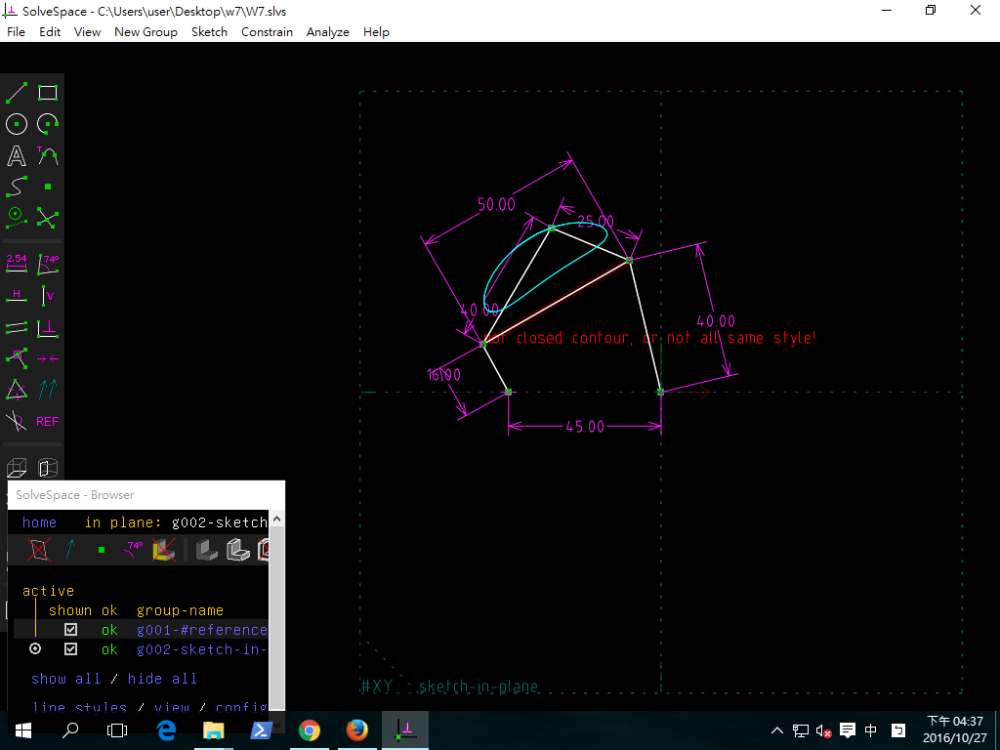

Title: 第七週
Date: 2016-10-27
Category: Misc
Tags: W7
Author: 40423108
四連桿機構

<!-- PELICAN_END_SUMMARY -->
已經四連桿各桿尺寸, 當機構繞行一圈後求特定點的座標, 以 Solvespace 進行點座標追蹤存檔, 得到
<a href="./../w7/w7.csv">w7_fourbar.csv</a>

根據下圖, 試驗證 Solvespace 機構模擬的資料之正確性.

Solvespace 四連桿圖檔:
<a href="./../w7/w7.slvs">按右鍵存檔</a>

